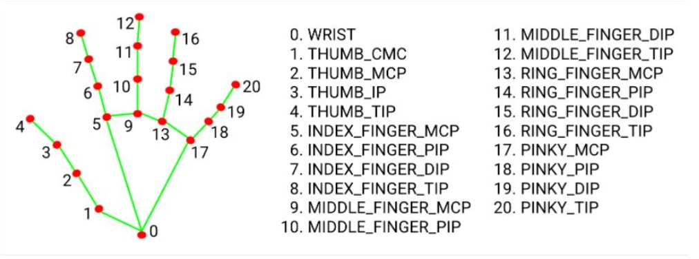
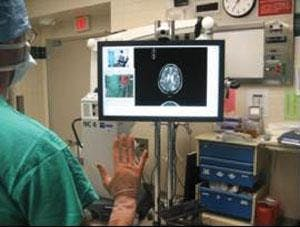
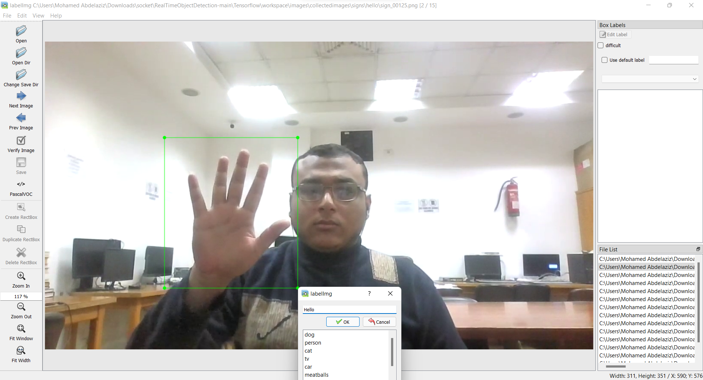
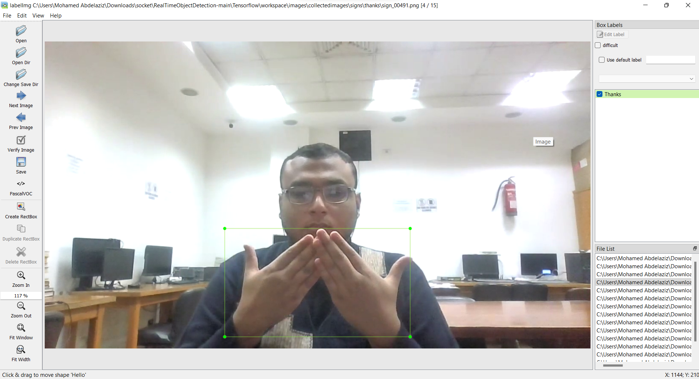
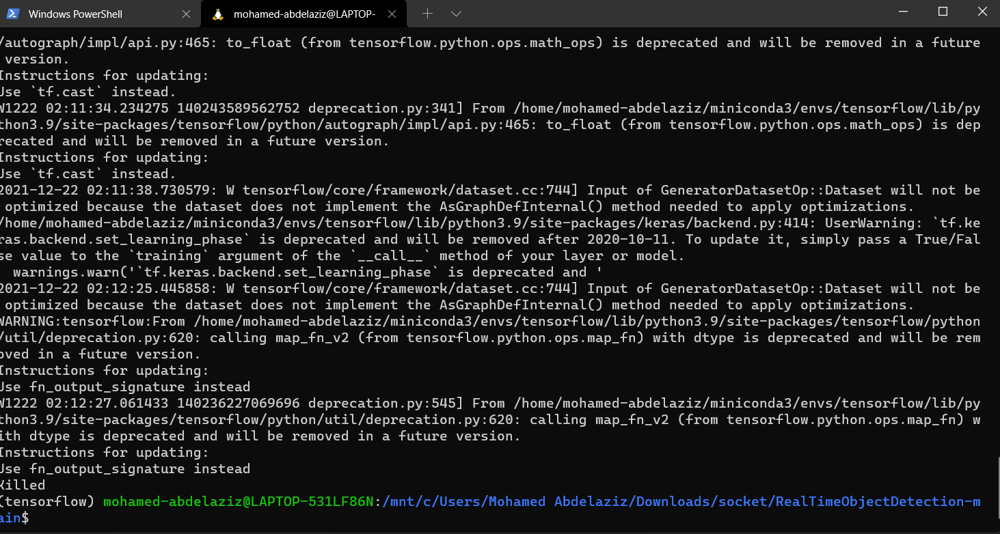

# Realtime Multi-client Video-Processing-with-socket-programming using TCP-protocol.

<p align="center">
  
</p>

Our application perform multi client video processing using the server hardware cabapilities which is handeled using threading.

Each new client request type of processing and send its source video.. the server perform the procesing real-time based on the client parser `--process`  

## Installations required
```python
- pip install comtypes
- pip install pycaw
- pip install pickle
- pip install imutils
- pip install opencv-python
- pip install mediapipe
```


## Use gesture control to change the volume of a computer.
[1] First we look into hand tracking and then we use hand landmarks to find gestures of our hand to change volume.

[2] Distance between index finger and thumb is used to change volume level.




## Applications in medical field:

* in operating rooms.\
    Doctors may soon be using a system in the operating room that recognizes hand gestures as commands to tell a computer to browse and display medical images of the patient during a surgery.
    
    Surgeons routinely need to review medical images and records during surgery, but stepping away from the operating table and touching a keyboard and mouse can delay the procedure and increase the risk of spreading infection-causing bacteria.

    One of the most ubiquitous pieces of equipment in surgical units is the computer workstation, which allows access to medical images before and during surgery. However, computers and their peripherals are difficult to sterilize, and keyboards and mice have been found to be a source of contamination. Also, when nurses or assistants operate the keyboard for the surgeon, the process of conveying information accurately has proven cumbersome and inefficient since spoken dialogue can be time-consuming and leads to frustration and delays in the surgery.
 
    the Gestix hand-gesture interface responds to the surgeon’s gesture commands in real time without requiring the surgeon to attach a microphone, use head-mounted (body-contact) sensing devices, or to use foot pedals to control the operation of the display system.\

    

* post-stroke rehabilitation.\
Some researchers developed a hand gesture recognition algorithm devoted to monitor the seven gestures for residential rehabilitation of the post-stroke patients.

* sign language.
  


## how to setup.

1.  to run server : 
```
> python .\server.py
```
make sure that the client ip is the same as the ip printed at the server 

2. to run the client and use gesture detection:
```
> python .\client.py --camera 'enable' --process 'gesture'

```
add multiple clients connected to the same server.\
also pressing q to exit the client application.

3. make edge processing for a video.
```
 > python .\client.py --video '.\videos\recording.mp4' --process 'edge'
```

3. recieve original video from server without processing
```
 > python .\client.py --video '.\videos\recording.mp4' --process 'original'
 > --video '.\videos\recording.mp4' --process 'original'  here are optional as they are set in the deafult parsering.
```


# Additional feature (NOT REQUIRED)
## Sign language ( Hand tracking transfer learning model [not finished] yet)

> their was an error running the transfer learning over ssd model, step [6] in `model.ipynb`  may be it exceeded the available ram.

We uploaded only notebooks for convienience as [tensorflow models, labeled images, ssd weights] exceed 300 MB)

## example of image labelling
<p align="center">
  
     
</p>

## error msg
<p align="center">
  
</p>
 
